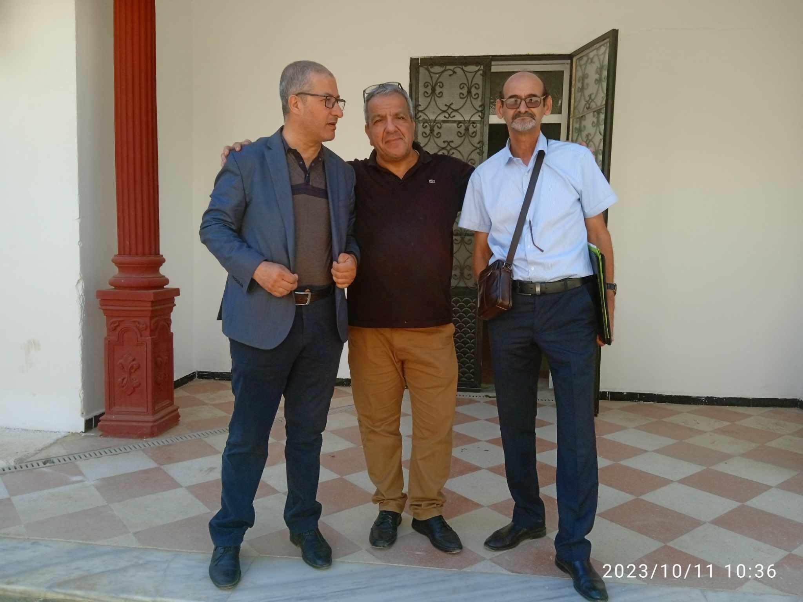
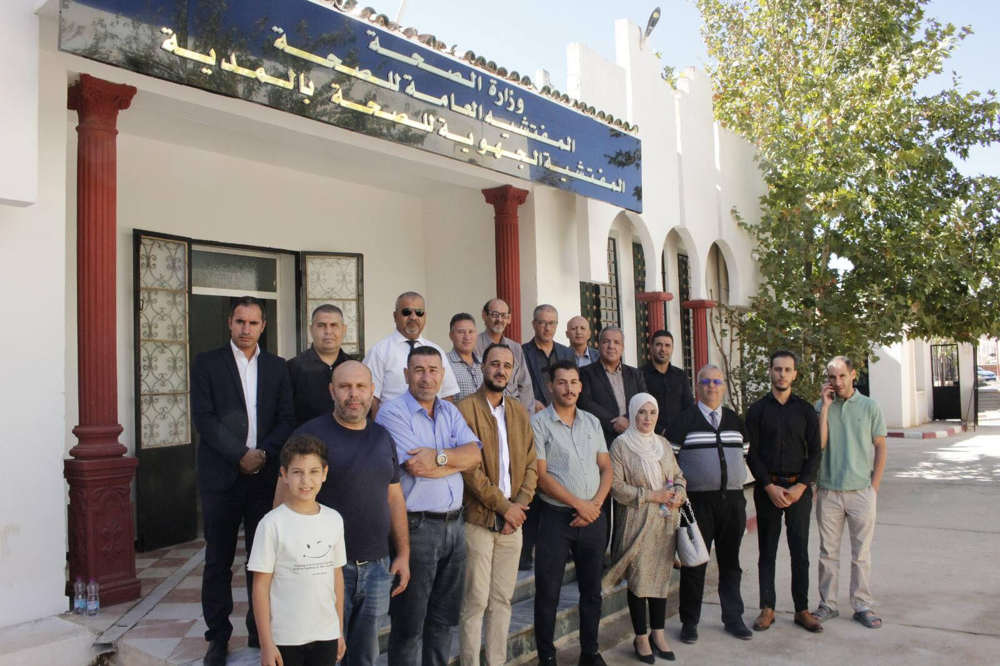
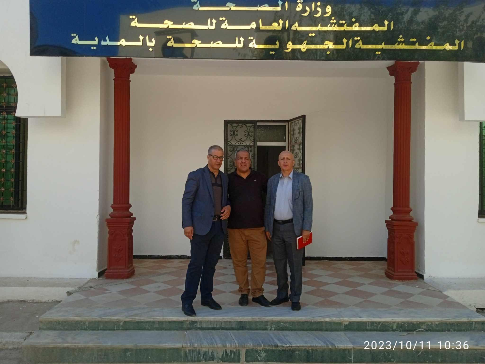

```{r setup, include=FALSE}
knitr::opts_chunk$set(echo = TRUE)
```

```{r load_library,echo=FALSE,warning=FALSE,error=FALSE,message=FALSE}
rm(list=ls())
if(!require(pacman))install.packages("pacman");library("pacman")
p_load(tidyverse,lubridate,ggthemes,sf,mapsf)
```

```{r load data ,echo=FALSE,warning=FALSE,error=FALSE,message=FALSE}
source("data.R",encoding = "UTF-8")
```


\newpage 


# Région de Médea ^[\copyright tibaredha]

## Structures de formation paramédicale publiques

```{r echo=FALSE,warning=FALSE,error=FALSE,message=FALSE}
pm11 <- region_pm %>% 
  dplyr::select(WILAYA,TYPE,DENOMINATION,CP,CH) %>% 
  dplyr::group_by(WILAYA) %>% 
  summarise(TOT=n(),
            CP=sum(CP),
            CH=sum(CH))  #%>% View()

pm22 <- data.frame(
  WILAYA="Total",
  TOT=sum(pm11[,"TOT"]),
  CP=sum(pm11[,"CP"]),
  CH=sum(pm11[,"CH"]))  
  
pm33 <- rbind(pm11,pm22)
knitr::kable(pm33)

```


## Ressources Humaines 

```{r echo=FALSE,warning=FALSE,error=FALSE,message=FALSE}
per1 <- region_p %>% 
  dplyr::select(GRADE,CHU,EPH,EHS,EH,EPSP) %>% 
  dplyr::group_by(GRADE) %>% 
  summarise(CHU=sum(CHU),
            EPH=sum(EPH),
            EHS=sum(EHS),
            EH=sum(EH),
            EPSP=sum(EPSP)) %>% 
  dplyr::mutate(TOT=CHU+EPH+EHS+EH+EPSP) #%>% View()
  
per2 <- data.frame(
  GRADE="Total",
  CHU=sum(per1[,"CHU"]),
  EPH=sum(per1[,"EPH"]),
  EHS=sum(per1[,"EHS"]),
  EH=sum(per1[,"EH"]),
  EPSP=sum(per1[,"EPSP"]),
  TOT=sum(per1[,"TOT"]))  
  
per3 <- rbind(per1,per2)
knitr::kable(per3)  
```


## Ressources matérielles 

```{r echo=FALSE,warning=FALSE,error=FALSE,message=FALSE}
EQUIP11 <- region_ml %>% 
  dplyr::select(ID,EQUIPEMENT,CHU,EPH,EHS,EH,EPSP) %>% 
  dplyr::group_by(EQUIPEMENT) %>% 
  summarise(CHU=sum(CHU),
            EPH=sum(EPH),
            EHS=sum(EHS),
            EH=sum(EH),
            EPSP=sum(EPSP)) %>%
  dplyr::mutate(TOT=CHU+EPH+EHS+EH+EPSP) #%>% View()
  
EQUIP22 <- data.frame(
  EQUIPEMENT="Total",
  CHU=sum(EQUIP11[,"CHU"]),
  EPH=sum(EQUIP11[,"EPH"]),
  EHS=sum(EQUIP11[,"EHS"]),
  EH=sum(EQUIP11[,"EH"]),
  EPSP=sum(EQUIP11[,"EPSP"]),
  TOT=sum(EQUIP11[,"TOT"]))  
  
EQUIP33 <- rbind(EQUIP11,EQUIP22)
knitr::kable(EQUIP33)  
```

\newpage

## Structures Sanitaires par Wilaya

```{r echo=FALSE,warning=FALSE,error=FALSE,message=FALSE}

communepop <- region_e %>% 
  dplyr::select(DAIRA,COMMUNE,TYPE,STRUCTURE,WILAYA) %>% 
  dplyr::group_by(WILAYA,TYPE) %>% summarise(tot=n()) %>% 
  tidyr::pivot_wider(names_from = TYPE, values_from = tot) %>% 
  dplyr::mutate(EPH=replace_na(EPH,0),
         EHS=replace_na(EHS,0),
         PC=replace_na(PC,0),
         SS=replace_na(SS,0)) %>% 
  dplyr::mutate(TOT=EPH+EHS+PC+SS)  

communepopt1  <- data.frame(WILAYA='Total',t(colSums(communepop[,-1])))
df_communepop <- rbind(communepop,communepopt1) 

knitr::kable(df_communepop)
```


```{r echo=FALSE,warning=FALSE,error=FALSE,message=FALSE}
# val11 <- region_e %>%
# dplyr::filter(TYPE=="EPH")%>%
# dplyr::select(DAIRA,COMMUNE,STRUCTURE,NBRLIT) %>% 
# dplyr::arrange(DAIRA,COMMUNE) #%>% knitr::kable()
# #a <- sum(val1[,"NBRLIT"]) 
# val22 <- data.frame(
#   DAIRA="Total",
#   COMMUNE="",
#   STRUCTURE="",
#   NBRLIT=sum(val11[,"NBRLIT"]))
# val33 <- rbind(val11,val22)
# knitr::kable(val33)
```

\newpage

```{r echo=FALSE,warning=FALSE,error=FALSE,message=FALSE}
# child="child1.Rmd"
```


```{r echo=FALSE,warning=FALSE,error=FALSE,message=FALSE}
wilayax <- c("Aindefla","Chlef","Medea","Djelfa","Laghouat","Msila")
# nbr <- 2
wilaya=wilayax[4]
```


# Wilaya de `r wilaya`

## Démographie

### Répartition par dairas  


```{r echo=FALSE,warning=FALSE,error=FALSE,message=FALSE}
tableau <- function(variables) {
 wilayapop2 <- region %>% 
  dplyr::select(WILAYA,IDD,COMMUNE,DAIRA,POP,SUP,EPH,EHS,PLC,SS,IDC) %>%
  dplyr::filter(WILAYA==variables) %>% # View() acorigé dans csv
  dplyr::mutate(DAIRA = as.factor(DAIRA)) %>% 
  dplyr::group_by(DAIRA) %>%
  dplyr::summarise(POPW = sum(POP),
                   SUPT=sum(SUP),
                   NCT=n()) %>%
  dplyr::mutate(DENS = round(POPW/SUPT, digits = 2)) %>%
  dplyr::arrange(DAIRA)
g <- c("NCT","POPW","SUPT")
totalpop22  <- data.frame(DAIRA='Total',DENS="***", t(colSums(wilayapop2[, g])))
# 4=POPW
# 5=SUPT

redha <- round(totalpop22[4]/totalpop22[5], digits = 2)
totalpop2  <- data.frame(DAIRA='Total',DENS=redha[,], t(colSums(wilayapop2[, g])))
df_new2 <- rbind(wilayapop2,totalpop2) #sep,
df_new2 %>%
  select(DAIRA,NCT,POPW,SUPT,DENS) %>%
  knitr::kable(caption = paste0("Démographie par Dairas Wilaya de ",variables),align = "lrrrrrrrr") 
}
```


```{r echo=FALSE,warning=FALSE}
tableau(wilaya)
```

\newpage


### Répartition par Communes  


```{r echo=FALSE,warning=FALSE}
tableau0 <- function(variables) {
communepop <- region %>% 
  dplyr::select(WILAYA,IDD,COMMUNE,DAIRA,POP,SUP,EPH,EHS,PLC,SS,IDC) %>%
  dplyr::filter(WILAYA==variables) %>% # View() acorigé dans csv
  dplyr::mutate(DAIRA = as.factor(DAIRA)) %>% 
  dplyr::select(COMMUNE,POP,SUP) %>%
  dplyr::mutate(DENS = round(POP/SUP, digits = 2)) %>%
  dplyr::arrange(COMMUNE) #%>% 
f <- c("POP", "SUP")  
communepopt0  <- data.frame(COMMUNE='Total',DENS="***", t(colSums(communepop[,f])))
# 3= pop
# 4= sup
tiba <- round(communepopt0[3]/communepopt0[4], digits = 2) 
communepopt  <- data.frame(COMMUNE='Total',DENS=tiba[,], t(colSums(communepop[,f])))
df_communepop <- rbind(communepop,communepopt) #sep,  
df_communepop %>%
  dplyr::select(COMMUNE,POP,SUP,DENS) %>% 
  knitr::kable(caption = paste0("Démographie par Communes Wilaya de " ,variables),align = "lrrrrrrrr")  
}
```


```{r echo=FALSE,warning=FALSE}
tableau0(wilaya)
```


\newpage
## Structures de formation paramédicale publiques

```{r echo=FALSE,warning=FALSE,error=FALSE,message=FALSE}
pm1 <- region_pm %>% 
  dplyr::filter(WILAYA==wilaya)%>%
  dplyr::select(TYPE,DENOMINATION,CP,CH) #%>% View()

pm2 <- data.frame(
  TYPE="Total",
  DENOMINATION="",
  CP=sum(pm1[,"CP"]),
  CH=sum(pm1[,"CH"]))  
  
pm3 <- rbind(pm1,pm2)
knitr::kable(pm3)
```


## Ressources Humaines 

```{r echo=FALSE,warning=FALSE,error=FALSE,message=FALSE}
per1 <- region_p %>% 
  dplyr::filter(WILAYA==wilaya)%>%
  dplyr::select(GRADE,CHU,EPH,EHS,EH,EPSP) %>%
 # dplyr::arrange(GRADE) %>%
  dplyr::mutate(TOT=CHU+EPH+EHS+EH+EPSP)
  
per2 <- data.frame(
  GRADE="Total",
  CHU=sum(per1[,"CHU"]),
  EPH=sum(per1[,"EPH"]),
  EHS=sum(per1[,"EHS"]),
  EH=sum(per1[,"EH"]),
  EPSP=sum(per1[,"EPSP"]),
  TOT=sum(per1[,"TOT"]))  
  
per3 <- rbind(per1,per2)
knitr::kable(per3)  

```


## Ressources matérielles 

```{r echo=FALSE,warning=FALSE,error=FALSE,message=FALSE}
equip1 <- region_ml %>% 
  dplyr::filter(WILAYA==wilaya)%>%
  dplyr::select(EQUIPEMENT,CHU,EPH,EHS,EH,EPSP) %>%
 # dplyr::arrange(GRADE) %>%
  dplyr::mutate(TOT=CHU+EPH+EHS+EH+EPSP)
  
equip2 <- data.frame(
  EQUIPEMENT="Total",
  CHU=sum(equip1[,"CHU"]),
  EPH=sum(equip1[,"EPH"]),
  EHS=sum(equip1[,"EHS"]),
  EH=sum(equip1[,"EH"]),
  EPSP=sum(equip1[,"EPSP"]),
  TOT=sum(equip1[,"TOT"]))  
  
equip3 <- rbind(equip1,equip2)
knitr::kable(equip3)  

```


\newpage

## Structures Sanitaires 

```{r echo=FALSE,warning=FALSE,error=FALSE,message=FALSE}
structure <- function(wilaya,type) {
val11 <- region_e %>%
dplyr::filter(TYPE==type,WILAYA==wilaya)%>%
dplyr::select(DAIRA,COMMUNE,STRUCTURE,NBRLIT) %>% 
dplyr::arrange(DAIRA,COMMUNE) #%>% knitr::kable()
#a <- sum(val1[,"NBRLIT"]) 
val22 <- data.frame(
  DAIRA="Total",
  COMMUNE="",
  STRUCTURE="",
  NBRLIT=sum(val11[,"NBRLIT"]))
val33 <- rbind(val11,val22)
knitr::kable(val33)
}
```


### Répartition des structures sanitaires publique par Circonscription

```{r echo=FALSE,warning=FALSE,error=FALSE,message=FALSE}

communepop <- region_e %>% 
  dplyr::filter(WILAYA==wilaya)%>%
  dplyr::select(DAIRA,COMMUNE,TYPE,STRUCTURE,EPSP) %>% 
  dplyr::group_by(EPSP,TYPE) %>% summarise(tot=n()) %>% 
  tidyr::pivot_wider(names_from = TYPE, values_from = tot) %>% 
  dplyr::mutate(EPH=replace_na(EPH,0),
         EHS=replace_na(EHS,0),
         PC=replace_na(PC,0),
         SS=replace_na(SS,0)) %>% 
  dplyr::mutate(TOT=EPH+EHS+PC+SS)  

communepopt1  <- data.frame(EPSP='Total',t(colSums(communepop[,-1])))
df_communepop <- rbind(communepop,communepopt1) 

knitr::kable(df_communepop)


```


### Répartition des structures sanitaires publique par dairas

```{r echo=FALSE,warning=FALSE,error=FALSE,message=FALSE}

communepop <- region_e %>% 
  dplyr::filter(WILAYA==wilaya)%>%
  select(DAIRA,COMMUNE,TYPE,STRUCTURE,EPSP) %>% 
  group_by(DAIRA,TYPE) %>% summarise(tot=n()) %>% 
  tidyr::pivot_wider(names_from = TYPE, values_from = tot) %>% 
  mutate(EPH=replace_na(EPH,0),
         EHS=replace_na(EHS,0),
         PC=replace_na(PC,0),
         SS=replace_na(SS,0)) %>% 
  mutate(TOT=EPH+EHS+PC+SS)  

communepopt1  <- data.frame(DAIRA='Total',t(colSums(communepop[,-1])))
df_communepop <- rbind(communepop,communepopt1) 

knitr::kable(df_communepop)

  
```


### Répartition des structures sanitaires publique par communes

```{r echo=FALSE,warning=FALSE,error=FALSE,message=FALSE}

communepop <- region_e %>% 
  dplyr::filter(WILAYA==wilaya)%>% 
  select(DAIRA,COMMUNE,TYPE,STRUCTURE,EPSP) %>% 
  group_by(COMMUNE,TYPE) %>% summarise(tot=n()) %>% 
  tidyr::pivot_wider(names_from = TYPE, values_from = tot) %>% 
  mutate(EPH=replace_na(EPH,0),
         EHS=replace_na(EHS,0),
         PC=replace_na(PC,0),
         SS=replace_na(SS,0)) %>% 
  mutate(TOT=EPH+EHS+PC+SS)  

communepopt1  <- data.frame(COMMUNE='Total',t(colSums(communepop[,-1])))
df_communepop <- rbind(communepop,communepopt1) #sep, 

knitr::kable(df_communepop)
```

### EPH

```{r echo=FALSE,warning=FALSE,error=FALSE,message=FALSE}
structure(wilaya,"EPH")
```

### EHS

```{r echo=FALSE,warning=FALSE,error=FALSE,message=FALSE}
structure(wilaya,"EHS")
```

### Polycliniques

```{r echo=FALSE,warning=FALSE,error=FALSE,message=FALSE}
structure(wilaya,"PC")
```

### Salles de soins

```{r echo=FALSE,warning=FALSE,error=FALSE,message=FALSE}
structure(wilaya,"SS")
```

### Maternités

```{r echo=FALSE,warning=FALSE,error=FALSE,message=FALSE}
region_e %>% 
  dplyr::filter(WILAYA==wilaya)%>% 
  dplyr::filter(MATERNITE=="y")%>% 
  select(DAIRA,COMMUNE,TYPE,STRUCTURE) %>% knitr::kable()
  # group_by(COMMUNE,MATERNITE) %>% summarise(tot=n()) 
  # 

```


```{r echo=FALSE,warning=FALSE}
# djelfa_e
# write.csv(x = djelfa_e,file = "tiba.csv")
# x <- cbind(x1 = 3, 
#            x2 = c(4:1, 2:5))
# 
# rowSums(x); 
# colSums(x)
```


<!--  -->

<!--  -->

<!--  -->

<!-- Le ciel n'est \textcolor{blue}{bleu} que par convention, -->

\newpage

### Répartition des structures sanitaires publique par EPSP
 
```{r, results='asis',echo=FALSE,warning=FALSE,message=FALSE}

epsp0 <- region_e %>% dplyr::filter(WILAYA==wilaya)   #%>% View()

epsp <- unique(epsp0$EPSP)

for (i in epsp) {
  cat(paste0("### EPSP : ",i))
  print(knitr::kable(
    region_e %>%
      
      dplyr::filter(EPSP==i) %>% 
      dplyr::select(STRUCTURE,TYPE,NBRLIT) %>% 
      dplyr::arrange(STRUCTURE)
    , caption = paste0("Structure Sanitaire EPSP : ",i)))
  cat('\n\n<!-- -->\n\n')
}
```


```{r echo=FALSE,warning=FALSE,message=FALSE}
# d1 <- head(djelfa_e[, c("STRUCTURE")], 5)
# d2 <- head(djelfa_e[, 1:3], 5)
# knitr::kable(
#   list(d1, d2),
#   caption = 'Two tables placed side by side.',
#   booktabs = TRUE, valign = 't'
# )
```


```{r echo=FALSE,warning=FALSE,message=FALSE}
# library(janitor)
# mtcars %>%
#   tabyl(am, cyl) %>%
#   adorn_totals()
```

```{r echo=FALSE,warning=FALSE,message=FALSE}
library(leaflet) # https://rstudio.github.io/leaflet/markers.html
library(htmlwidgets)
library(webshot)
#1-that you are required to install PhantomJS to get the following code to work.
#2-D:\R_prgramme\phantomjs-2.1.1-windows\bin set to path
```


```{r echo=FALSE, fig.height=3, fig.width=3, message=FALSE, warning=FALSE}

# m <- leaflet() %>% addTiles() %>%         
#      addMarkers(lng=2.87341, lat=33.80328, popup="The birthplace of R")
#      # setView(lng=2.87341, lat=33.80328, zoom = 18)
# m 

## save html to png
# saveWidget(m, "temp.html", selfcontained = FALSE)
# webshot("temp.html", 
#         file = "Rplot.png",
#         cliprect = "viewport")
```


```{r echo=FALSE, fig.height=3, fig.width=3, message=FALSE, warning=FALSE}
# gps <- laghouat_e %>%
#   dplyr::filter(TYPE=="EPH") %>%
#   select(STRUCTURE,LATITUDE,LONGITUDE)
# 
# leaflet(data = gps) %>% addTiles() %>%
#   addMarkers(~LONGITUDE, ~LATITUDE,
#              popup = ~as.character(STRUCTURE),
#              label = ~as.character(STRUCTURE))
```


```{r echo=FALSE,warning=FALSE,message=FALSE}
# par(mfrow=(c(1,2)))
# # , dsp djelfa
# # , eph djelfa  
# # , 
# m <- leaflet() %>% addTiles()
# 
# m %>%
#   fitBounds(lat1 = 34.66137359665256,lng1 =3.2646258533865993 ,
#             lat2 = 34.663500337513014,lng2 =3.2650871933464303 ) %>%
#   #addMeasure()
# 
#   addMeasure(
#     position = "bottomleft",
#     primaryLengthUnit = "meters",
#     primaryAreaUnit = "sqmeters",
#     activeColor = "#3D535D",
#     completedColor = "#7D4479")
# 
# 

```


```{r echo=FALSE,warning=FALSE,message=FALSE}
# library(geosphere)
# distm(c(3.2646258533865993, 34.66137359665256), 
#       c(3.2650871933464303, 34.663500337513014), 
#       fun = distHaversine)
```

